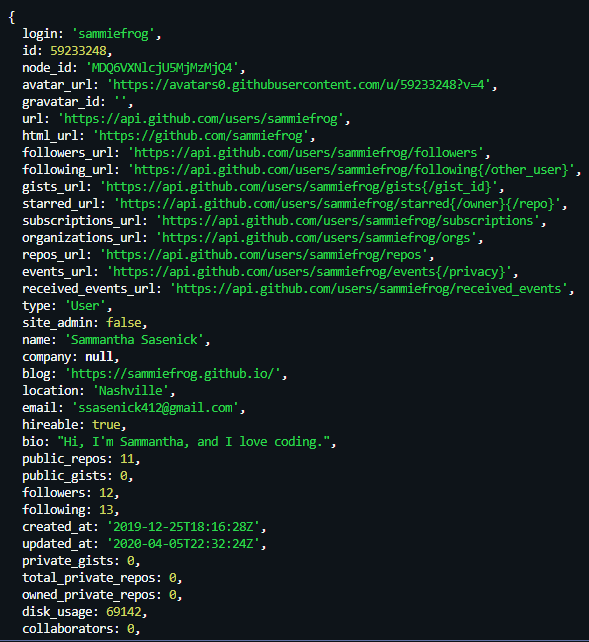

# README Generator

  
## Contributors
@sammiefrog
    
## Table of Contents
<li><a href="#description">Description</a></li>  
<li><a href="#installation">Installation</a></li> 
<li><a href="#tech">Technology Stack</a></li> 
<li><a href="#usage">Usage</a></li> 
<li><a href="#screenshots">Screenshots</a></li> 
<li><a href="#contact">Contact</a></li> 
<li><a href="#license">License</a></li> 
<li><a href="#tests">Tests</a></li> 
  
<h2 id= "description">Description</h2>
This is a project built with Javascript and Node.js that generates a README.md file in markdown format. This project utilizes the Node.js packages axios, fs, inquirer, and dotenv. README.md template created using template literal.
  
<h2 id= "installation">Installation</h2>
<li>Fork this repository and clone to your machine  </li> 
<li>'npm install' will install the required packages from the JSON file</li> 
<li>Obtain a personal access token from GitHub  </li> 
<li>Put said token in a dotenv files after GITHUB_TOKEN= and watch it work!</li> 
    
<h2 id= "technology">Technology Stack</h2>
 Node.Js, JavaScript, GIT
  
<h2 id= "usage">Usage</h2>
To generate a basic README.md quickly and easily.

<h2 id= "screenshots">Screenshots</h2>

  
<h2 id= "contact">Contact</h2>
<li>Name: Sammantha Sasenick</li> 
<li>Github: @[sammiefrog](https://github.com/sammiefrog)</li> 
<li>Portfolio: [sammiefrog.github.io](sammiefrog.github.io)</li> #### Portfolio: [sammiefrog.github.io](sammiefrog.github.io)
<li>Email: [ssasenick412@gmail.com](ssasenick412@gmail.com)</li> 
<li>LinkedIn: www.linkedin.com/in/sammantha-sasenick412</li> 
    
<h2 id= "tests">Tests</h2>

